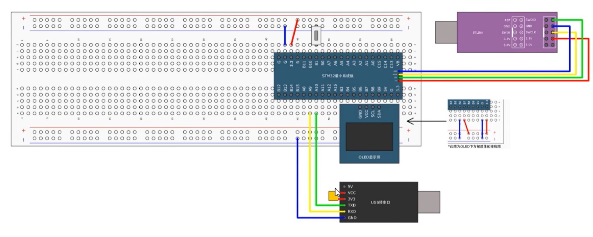

# 基于stm32f103vgt6最小系统板的OLED显示方案

### 实现原理：  
通过pc的python脚本利用`opencv`进行`视频帧读取`、`转换灰度图`和`二值化`后，将128*8 Byte的视频帧数据`串口`传输给单片机，单片机再通过`I2C软件模拟`输出OLED显示模块显示  

### 快速使用
1. 先按照[硬件接线](#硬件接线)连接好单片机与其外挂设备
2. stlink连接pc烧录`STM32F103VGT6_Code`工程代码
3. usb转串口连接电脑，并用串口助手查看串口号COMx
4. 配置`video.py`脚本main函数参数`input_path`,`serial_port`和`baudrate`
5. 更改`video.py`脚本里的`threshold`和`time.sleep(x)`以更好显示图像
   
> `video.py`中baudrate务必和工程代码波特率保持一致，且最好保持在较高值

---

### 硬件接线

### 软件实现

1. pc实现请查看`video.py`脚本
2. 单片机实现请查看`9-3 电脑串口发送数据包OLED显示视频`的工程代码

### 参考
1. `9-3 电脑串口发送数据包OLED显示视频`的工程代码修改自[江协科B站视频](https://www.bilibili.com/video/BV1th411z7sn/?spm_id_from=333.337.search-card.all.click)
2. 脚本`video.py`修改自[deepseek](https://chat.deepseek.com/)提供的模板代码